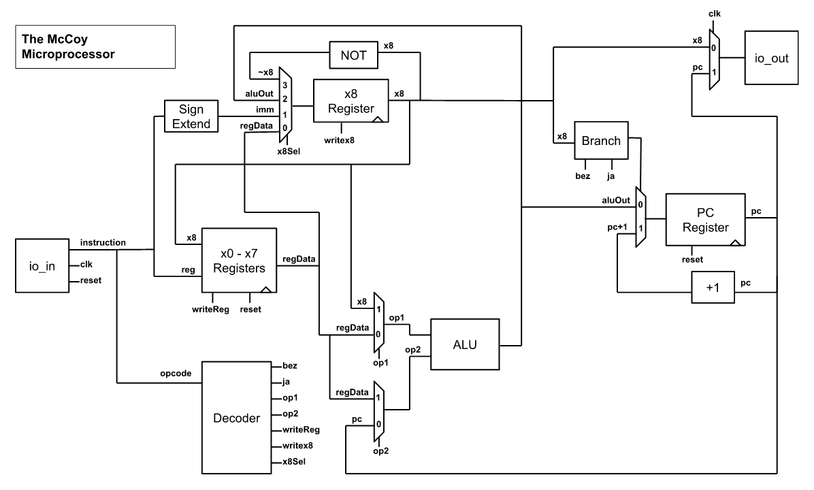

  

# The McCoy 6-bit Custom Microprocessor 

With design inspirations from the RISC-V ISA and [Zinnia](https://github.com/cpldcpu/tinytapeout_mcpu5) microprocessor.

Created over a 2 week period for submission into the Tiny Tapeout 2 Program, which has the following restrictions:

 - Die area is 100 µm² using the Skywater 130nm node. This gives an estimated average of 500 gates that can fit on the die area.
 - Limited to 8 digital input and 8 digital output signals.

## Overview of Architecture

A RISC 6-bit CPU based on the Harvard Architecture. 7 instructions, 10 registers. Register x0 is always 0, registers x1 through x7 are general purpose, register x8 is a special function register and output, final register holds PC. All instructions have fixed length opcodes. Currently there is no method to detect overflow, which would require an additional instruction like RISC-V's sli. 

The 8 input bits:
 - The clock signal
 - The reset signal
 - 6 remaining bits for the instruction

The 8 output bits:
 - When clock is high, output is PC
 - When clock is low, output is x8
 - The two MSB bits are unused since the processor output is 6-bits.

## Instruction Set Architecture

Since two of the inputs are used for the clock and reset, that leaves us with 6 bits for instructions. 8 instructions and 8 addressable registers or 3-bit immediate values seemed like the most balanced choice, so instructions are broken into the following 3 types:

| Type |  |  |
|---|---|---|
| I | 3 Immediate bits | 3 Opcode bits |
| R | 3 Register bits | 3 Opcode bits |
| X | 3 Don't Cares | 3 Opcode bits |

The 3 register bits in R-type instructions can access registers x0 through x7.

The 3 immediate bits in I-type instructions will be interperted as a 2's compliment number, and will be sign extended to 6-bits. This limits inputs to the range -4 to 3, but the full -32 to 31 integer range can be achieved with repeat add instructions.

Here are the 7 instructions, their encoding, and their operation:

| Mnemonic | Reg/Imm | Opcode | Instruction | Operation |
| ---      |---|---|---|---|
| li | iii | 000 | Load Immediate to x8 | x8 = imm |
| add | rrr | 001 | Add Register to x8 | x8 = x8 + reg |
| bez | rrr | 010 | Branch if x8 = 0 | PC = (x8 == 0) ? PC + reg : PC + 1 |
| lr | rrr | 011 | Load Register to x8 | x8 = reg |
| sr | rrr | 101 | Store x8 to Register | reg = x8 |
| ja | xxx | 110 | Jump by x8 | PC = PC + x8 |
| not | xxx | 111 | Not x8 | x8 = ~x8 |

With these instructions addition, subtraction*, multiplication*, and division** can be executed on the processor. 

*these can be implimented with add, not, li, bez, lr, and sr instructions.

**division will truncate the remainder via repeated subtraction, and without an sli-like instruction this isn't really being done by the processor as you'll need to know in advance how many times to loop.

## Special Case Registers (x0, x8, PC)

Like the RISC-V ISA, the x0 register is always going to contain the number 0. In this design it is safe to try to write another number to the x0 register, nothing will happen. Any read from the x0 register will return 0.

The PC register, since it is 6-bits, allows for programs of up to 2^6 = 64 instructions long. The only way to manually change the PC is through reset, which will set it back to 0, or through ja and bez. Otherwise it will increment by 1 each clock cycle.

The x8 register is very similar to the Accumulator from the [Zinnia](https://github.com/cpldcpu/tinytapeout_mcpu5) microprocessor. This register is necessary because the limited instruction length means instructions can only access one register. To get around this limitation, x8 acts as either a default source register (sr, not, jump, add, bez) or a default destination register (add, li, lr, not). 

## Thoughts 

For something I spent 1 week designing the ISA and drawing circuit diagrams, and 1 week writing and debugging and optimizing the verilog to fit within the tight constraints, I think it turned out okay. Originally meant to be an 8-bit design, but flip-flops are very large and 80 of them is too many so I had to drop it down to 6-bit registers.

The not instruction was originally going to be an ALU operation, but the gds tests were unable to successfully fit the design that way, even after optimizing the design from an area of 3,812 µm **without** the ALU not instruction (commit #14) down to an area of 3,482 µm **with** the ALU not instruction (commit #18). I ended up copying what I had done to impliment pc+1, and make not its own module outside the ALU and add a 4-input mux.

